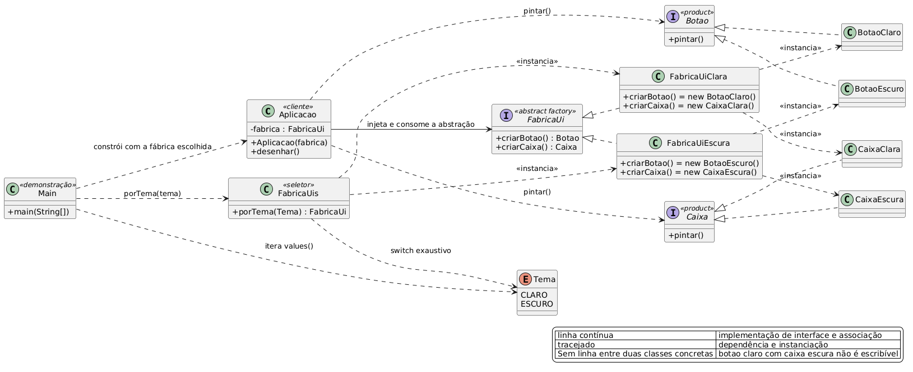

# Abstract Factory

## Diagrama de classes



Fonte editável em `diagrama.puml` (PlantUML).

## Como funciona

A fábrica expõe um método por produto da família e entrega implementações da mesma variante em todos
eles. O cliente recebe a família pronta, e a escolha da variante fica inteira na fábrica.

```java
FabricaUiClara                 FabricaUiEscura
  |- criarBotao() -> BotaoClaro   |- criarBotao() -> BotaoEscuro
  `- criarCaixa() -> CaixaClara   `- criarCaixa() -> CaixaEscura
```

Com `FabricaUi` como único ponto de contato, botão e caixa chegam sempre do mesmo tema. Trocar a
família inteira significa trocar um objeto na fronteira do programa.

O custo aparece quando a família cresce: incluir um produto novo exige alterar todas as fábricas.

## Aplicação

| Papel | Arquivo |
|---|---|
| Produtos abstratos | `Botao.java`, `Caixa.java` |
| Produtos concretos | `BotaoClaro.java`, `CaixaClara.java`, `BotaoEscuro.java`, `CaixaEscura.java` |
| Abstract Factory | `FabricaUi.java` (interface) |
| Fábricas concretas | `FabricaUiClara.java`, `FabricaUiEscura.java` |
| Seleção de variante | `FabricaUis.java`, `Tema.java` |
| Cliente | `Aplicacao.java` |
| Demonstração | `Main.java` |

`FabricaUi` é interface, então a hierarquia da fábrica não guarda estado nem implementa método
concreto. Cada fábrica concreta devolve o par de produtos do seu tema. `Aplicacao` recebe `FabricaUi`
no construtor, e as duas variantes passam pelo mesmo `desenhar()`, linha por linha idênticas.

`Tema` e `FabricaUis.porTema` isolam a escolha da variante em um switch exaustivo. Acrescentar um
tema é somar uma constante e um `case`, e o `for` do `Main` passa a cobrir a variante nova sozinho,
porque itera `Tema.values()`.

`Botao` e `Caixa` expõem o que o cliente usa, `pintar()`. O estilo visual fica escondido atrás da
fábrica.

## Saída

```
tema CLARO
  [claro] botao
  [claro] caixa
tema ESCURO
  [escuro] botao
  [escuro] caixa
```

## Executar

```bash
javac -d out *.java
java -cp out abstractfactory.Main
```
