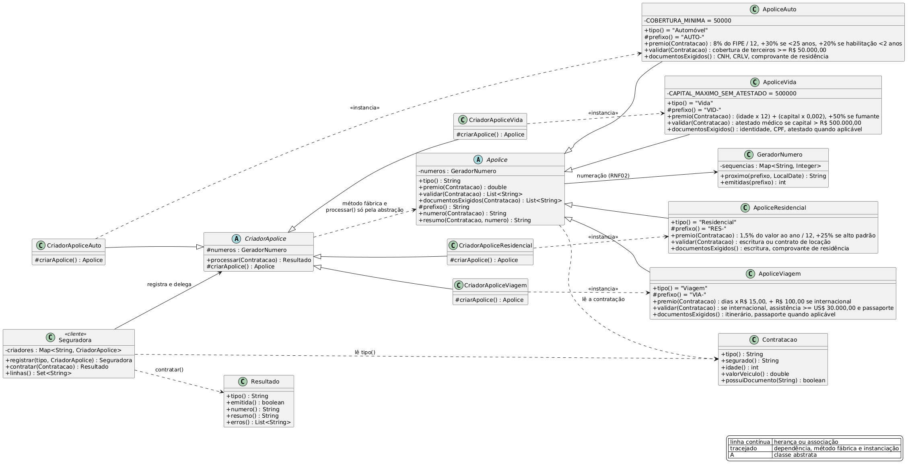

# Exercício 1: Sistema de Emissão de Apólices (Factory Method)

O enunciado nomeia o padrão. RNF01 é o requisito que exige mais cuidado: a quinta linha de produto
tem que entrar sem alterar nenhuma classe em produção.

## Diagrama de classes



Fonte editável em `diagrama.puml` (PlantUML).

## Como o padrão foi aplicado

| Papel do padrão | Classe | Papel na regra |
|---|---|---|
| Product (abstrato) | `Apolice` | cálculo de prêmio, validação, documentos e resumo |
| Concrete Products | `ApoliceAuto`, `ApoliceResidencial`, `ApoliceVida`, `ApoliceViagem` | RF01 a RF04 |
| Creator (abstrato) | `CriadorApolice` | `processar()` concreto e final, `criarApolice()` abstrato |
| Concrete Creators | `CriadorApoliceAuto`, `CriadorApoliceResidencial`, `CriadorApoliceVida`, `CriadorApoliceViagem` | um por linha de produto |
| Client | `Seguradora` | registra criadores e delega |

O método fábrica (`criarApolice`) fica isolado nas subclasses de criador. O algoritmo de processamento
mora inteiro em `CriadorApolice.processar()`, e ele só enxerga a abstração `Apolice`:

```java
public final Resultado processar(Contratacao contratacao) {
    Apolice apolice = criarApolice();
    List<String> erros = apolice.validar(contratacao);
    if (!erros.isEmpty()) {
        return Resultado.rejeitado(apolice.tipo(), erros);
    }
    String numero = apolice.numero(contratacao);
    return Resultado.emitido(apolice.tipo(), numero, apolice.resumo(contratacao, numero));
}
```

Uma linha de produto nova exige três arquivos: o produto, o criador e uma linha no registro do
cliente. `Apolice`, `CriadorApolice` e `Seguradora` ficam intactos, o que atende ao RNF01.

A seleção do cliente sai de um `Map`, o que evita estrutura condicional por tipo:

```java
public Resultado contratar(Contratacao contratacao) {
    CriadorApolice criador = criadores.get(contratacao.tipo());
    if (criador == null) {
        throw new IllegalArgumentException("linha de produto sem criador registrado: " + contratacao.tipo());
    }
    return criador.processar(contratacao);
}
```

O `if` cobre apenas o tipo sem creator registrado.

## Regras implementadas

| Requisito | Onde | Regra |
|---|---|---|
| RF01 | `ApoliceAuto` | 8% do FIPE dividido por 12, +30% se idade < 25, +20% se habilitação < 2 anos. Rejeita cobertura de terceiros abaixo de R$ 50.000,00 |
| RF02 | `ApoliceResidencial` | 1,5% do valor do imóvel ao ano dividido por 12, +25% se alto padrão. Exige escritura ou contrato de locação |
| RF03 | `ApoliceVida` | (idade × 12) + (capital × 0,002), +50% se fumante. Exige atestado médico acima de R$ 500.000,00 |
| RF04 | `ApoliceViagem` | dias × R$ 15,00, + R$ 100,00 se internacional. Internacional exige assistência ≥ US$ 30.000,00 e passaporte |
| RNF01 | `Seguradora.registrar` | linha nova = produto novo + creator novo + registro |
| RNF02 | `GeradorNumero` + `Apolice.prefixo` | sequências separadas por prefixo: AUTO-, RES-, VID-, VIA- |
| RNF03 | `Apolice.resumo` | número, segurado, data de emissão, prêmio e documentos |

Em RF01 e RF02 os acréscimos incidem sobre o prêmio anual e a divisão por 12 vem depois. RF03 e RF04 já
entregam valor mensal, então não dividem.

Os quatro criadores compartilham uma instância de `GeradorNumero`, passada pelo construtor. A sequência
é separada por prefixo, o que mantém a unicidade com várias apólices do mesmo tipo no mesmo dia.

`Contratacao` guarda os dados da contratação com uma API fluida e normaliza documentos: acento,
caixa e espaço são ignorados na comparação, então `"comprovante de residÊNCIA"` casa com
`"Comprovante de residência"`.

## Saída

```
linhas registradas: [AUTO, RES, VID, VIA]

--- RF01 Automóvel emitida (condutor jovem, habilitação recente)
Apólice AUTO-20260929-0001
Linha: Automóvel
Segurado: Ana Ribeiro
Emissão: 29/09/2026
Prêmio mensal: R$ 540,80
Documentos exigidos: CNH, CRLV, Comprovante de residência
...
--- RF01 Automóvel rejeitada (cobertura de terceiros insuficiente)
CONTRATACAO REJEITADA (Automóvel)
  - cobertura de terceiros mínima de R$ 50.000,00 não atendida
```

O `main` roda oito cenários, com uma emissão e uma rejeição para cada linha. O prêmio do primeiro
caso confere com a fórmula: 52.000 × 8% = 4.160 por ano, ×1,3 ×1,2 = 6.489,60, e 6.489,60 ÷ 12 dá
540,80.

## Executar

```bash
javac -d out *.java
java -cp out apolice.Main
```
