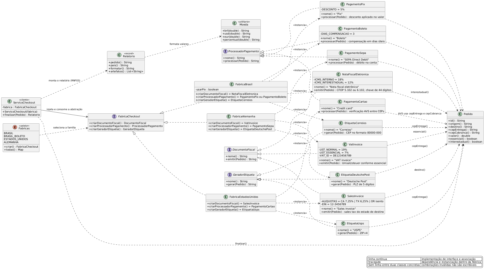

# Exercício 2: Checkout Internacional de Marketplace

O enunciado deixa o padrão a identificar. A pista está em RF: três artefatos que precisam pertencer
ao mesmo país, o que descreve uma família de objetos coerentes. Na família GoF, o padrão que atende a
isso é o **Abstract Factory**. A fábrica entrega os três artefatos da mesma variante, e trocar de país
significa trocar de fábrica.

## Diagrama de classes



Fonte editável em `diagrama.puml` (PlantUML).

## Como o padrão foi aplicado

| Papel do padrão | Classe |
|---|---|
| Abstract Factory | `FabricaCheckout` (interface, 3 métodos de criação) |
| Concrete Factories | `FabricaBrasil`, `FabricaEstadosUnidos`, `FabricaAlemanha` |
| Product (abstrato) | `DocumentoFiscal`, `ProcessadorPagamento`, `GeradorEtiqueta` (interfaces) |
| Concrete Products | `NotaFiscalEletronica` / `SalesInvoice` / `VatInvoice`, `PagamentoPix` / `PagamentoBoleto` / `PagamentoCartao` / `PagamentoSepa`, `EtiquetaCorreios` / `EtiquetaUsps` / `EtiquetaDeutschePost` |
| Seletor | `Fabricas` (enum) |
| Client | `ServicoCheckout` |

`ServicoCheckout` recebe `FabricaCheckout` no construtor e consome só a interface:

```java
public Relatorio finalizar(Pedido pedido) {
    DocumentoFiscal fiscal = fabrica.criarDocumentoFiscal();
    ProcessadorPagamento pagamento = fabrica.criarProcessadorPagamento();
    GeradorEtiqueta etiqueta = fabrica.criarGeradorEtiqueta();
    ...
}
```

A classe não tem `if` por país, o que atende ao RNF02. A garantia do RNF01 vem da estrutura: os três
artefatos saem da mesma fábrica, e o cliente não conhece as classes concretas, o que impede escrever
uma nota fiscal brasileira junto com uma etiqueta americana.

O `main` escolhe a família pelo enum:

```java
new ServicoCheckout(Fabricas.ESTADOS_UNIDOS.criar()).finalizar(eua)
```

Um quarto país entra como `FabricaFranca implements FabricaCheckout` mais uma constante no enum.
`ServicoCheckout`, as três interfaces de produto e as nove classes existentes seguem sem alteração.

## Regras implementadas

| Requisito | Classe | Regra |
|---|---|---|
| RF01 BR | `NotaFiscalEletronica` | CFOP 5.102 interno, 6.102 interestadual, ICMS 18% ou 12%, chave de 44 dígitos |
| RF01 BR | `PagamentoPix` | 5% de desconto |
| RF01 BR | `PagamentoBoleto` | compensação em 3 dias úteis |
| RF01 BR | `EtiquetaCorreios` | CEP no formato 00000-000 |
| RF02 US | `SalesInvoice` | sales tax por estado: CA 7,25%, TX 6,25%, OR isento; EIN do vendedor |
| RF02 US | `PagamentoCartao` | verificação AVS comparando CEP de entrega e de cobrança |
| RF02 US | `EtiquetaUsps` | ZIP+4 |
| RF03 DE | `VatInvoice` | USt 19%, ou 7% para produto essencial; VAT-ID do vendedor |
| RF03 DE | `PagamentoSepa` | SEPA Direct Debit |
| RF03 DE | `EtiquetaDeutschePost` | PLZ de 5 dígitos |
| RNF03 | `Relatorio.formatar` | layout único com os três artefatos |

`Pedido.interestadual()` compara origem e destino, e decide o CFOP e a alíquota de ICMS. `SalesInvoice`
guarda as alíquotas num `Map` por estado e recusa estado sem cadastro, o que evita silenciar uma taxa
faltando. Os geradores de etiqueta conferem a quantidade de dígitos do CEP, do PLZ e do ZIP antes de
formatar.

A chave de acesso de 44 dígitos sai de um hash determinístico do id e do valor, o que torna a mesma
execução reprodutível.

## Saída

```
RF01 Brasil (interestadual, Pix)
Pedido BR-1043 (Nota fiscal eletrônica)

Documento: Nota fiscal eletrônica
Chave de acesso: 00000000000000000000000002220056404906679419
CFOP: 6.102
ICMS: 12,00%
Base: R$ 1.200,00
Total: R$ 1.344,00

Meio: Pix
Desconto: 5,00%
Cobrado: R$ 1.140,00

Carrier: Correios
CEP: 20031-000 (BR)
Destino: RJ
```

O `main` finaliza seis pedidos: Brasil interestadual com Pix, Brasil interno com Pix, Brasil interno
com boleto, EUA em California, EUA em Oregon (isento) e Alemanha com produto essencial. O primeiro
caso mostra a mudança de CFOP e de alíquota com origem e destino diferentes.

## Executar

```bash
javac -d out *.java
java -cp out checkout.Main
```
