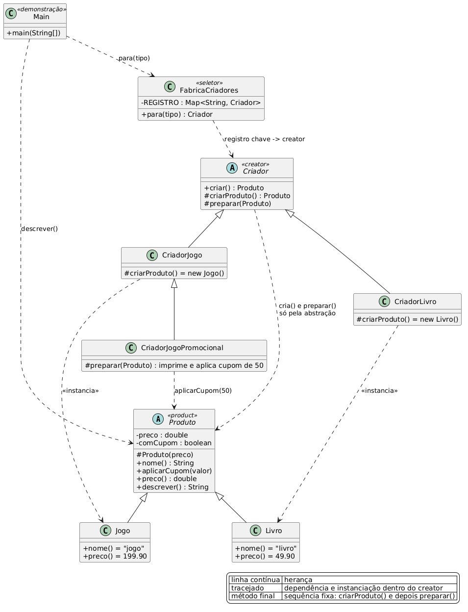

# Factory Method

## Diagrama de classes



Fonte editável em `diagrama.puml` (PlantUML).

## Como funciona

A classe base declara um método de fábrica abstrato, e cada subclasse devolve o seu produto concreto.
O cliente pede pela abstração comum, então um produto novo vira uma subclasse nova sem alterar o
código que já existe.

```java
Criador (abstrata)
  |- criar()                // método de fábrica, visível ao cliente
  |    |- criarProduto()    // abstrato: cada subclasse devolve o seu produto
  |    `- preparar()        // gancho com implementação padrão
```

O GoF mostra apenas `criarProduto()` abstrato. Aqui `criar()` é final e funciona como template
method: a sequência fica na base, e o gancho `preparar()` deixa a subclasse trocar um passo.

## Aplicação

| Papel | Arquivo |
|---|---|
| Produto (abstrata) | `Produto.java` |
| Produtos concretos | `Livro.java`, `Jogo.java` |
| Creator (abstrata) | `Criador.java` |
| Criadores concretos | `CriadorLivro.java`, `CriadorJogo.java`, `CriadorJogoPromocional.java` |
| Registro | `FabricaCriadores.java` |
| Demonstração | `Main.java` |

`Produto` é abstrata, define `preco`, `aplicarCupom` e `descrever`, e exige `nome()` de cada
subtipo. `criar()` é final de propósito: a ordem "criar e depois preparar" pertence à base, e as
subclasses trocam o passo sem mexer na sequência. `preparar()` tem implementação padrão, então
sobrescrever é opcional.

`CriadorJogoPromocional` estende `CriadorJogo` e sobrescreve apenas `preparar()`, onde chama
`aplicarCupom(50)`. O cupom aparece na saída: o preço cai de 199.90 para 149.90 dentro do mesmo
fluxo de criação. Um creator que devolvesse outro objeto e deixasse o fluxo intacto provaria menos.

`FabricaCriadores` é a parte "factory" do nome: um `Map` imutável liga chave a creator, e quem
chama escolhe a chave e recebe a abstração `Criador`. Essa escolha fica fora da hierarquia de
classes. Produto novo significa creator novo e uma entrada no mapa. O `Main` resolve tudo por
`FabricaCriadores.para(tipo)`, e cada `new` de produto mora dentro de um creator.

## Saída

```
preparando livro
  -> livro por 49.90
preparando jogo
  -> jogo por 199.90
preparando jogo com cupom
  -> jogo por 149.90 com cupom
```

## Executar

```bash
javac -d out *.java
java -cp out factorymethod.Main
```
