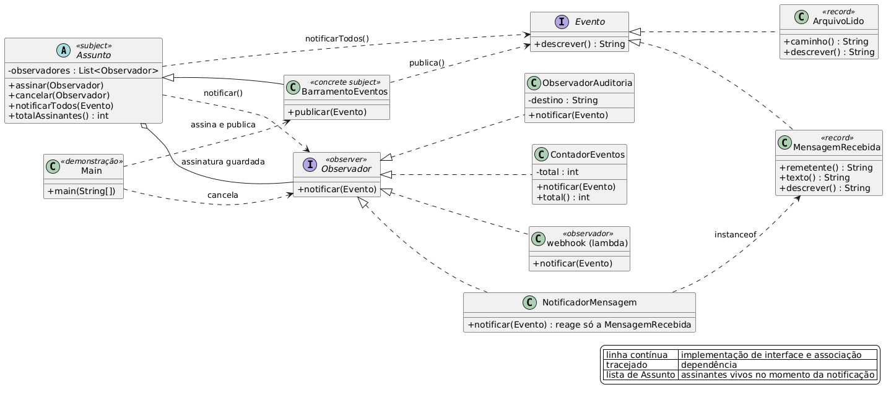

# Observer

## Diagrama de classes



Fonte editável em `diagrama.puml` (PlantUML).

## Como funciona

O Subject mantém a lista de observadores. A cada evento ele percorre essa lista e chama o método de
notificação de cada observador. O Observador implementa uma interface de um método e decide o que
fazer com o evento recebido. Quem publica o evento enxerga a interface `Observador`, e a lista de
assinantes pode mudar com o sistema rodando.

```java
Assunto
  |- assinar(Observador)      // entra na lista
  |- cancelar(Observador)     // sai da lista
  `- notificarTodos(Evento)   // percorre a lista
```

## Aplicação

| Papel | Arquivo |
|---|---|
| Observador (interface) | `Observador.java` |
| Subject (abstrata) | `Assunto.java` |
| Concrete Subject | `BarramentoEventos.java` |
| Observadores concretos | `ObservadorAuditoria.java`, `ContadorEventos.java`, `NotificadorMensagem.java` |
| Evento (abstração) | `Evento.java` |
| Eventos concretos | `MensagemRecebida.java`, `ArquivoLido.java` |
| Demonstração | `Main.java` |

`Assunto` concentra a mecânica da lista e é abstrata porque a semântica do domínio fica no filho.
`BarramentoEventos` acrescenta `publicar`, que imprime o evento e delega para `notificarTodos`.

A notificação percorre uma cópia da lista, então um observador pode se cancelar durante o próprio
evento sem estourar a iteração. `cancelar` remove por identidade: o `Main` guarda o
`ObservadorAuditoria` numa variável e passa a mesma referência. Lambda criada na chamada não tem
como ser recuperada depois, porque `equals` de lambda compara identidade.

`NotificadorMensagem` filtra com `instanceof MensagemRecebida`. Ele recebe todo evento e reage ao
que lhe interessa, o que dispensa o `Assunto` de conhecer os tipos concretos de evento.
`ContadorEventos` guarda estado próprio, e os observadores seguem independentes uns dos outros. O
quarto assinante do `Main` é uma lambda convertida em `Observador`.

## Saída

```
BarramentoEventos: publica mensagem de ana: oi
  auditoria -> auditoria.log | mensagem de ana: oi
  contador: 1 (mensagem de ana: oi)
  notificacao: ana -> oi
  webhook: mensagem de ana: oi
...
contador recebeu 3 eventos
```

O contador recebeu 3 eventos porque `ArquivoLido` também o notifica. Depois do `cancelar` a auditoria
sume da saída.

## Executar

```bash
javac -d out *.java
java -cp out observer.Main
```
