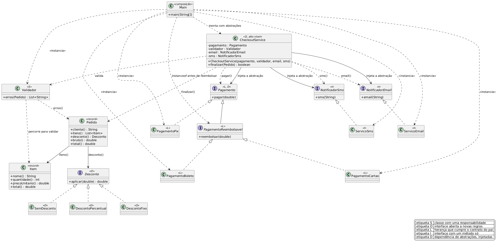

# SOLID

## Diagrama de classes



Fonte editável em `diagrama.puml` (PlantUML).

## Os princípios

Os princípios não têm estrutura fixa como os padrões GoF. Aqui eles aparecem num fluxo só, o checkout
de um pedido numa loja. A loja valida o pedido, aplica desconto, cobra por boleto, cartão ou pix e
avisa o cliente por e-mail e SMS.

## S, responsabilidade única

`Validador` devolve a lista de erros e nada além disso. `Pedido` guarda os dados e calcula o total.
`CheckoutService` valida, cobra e notifica, nessa ordem. Cada mudança fica contida no seu arquivo: a
regra de desconto vive em `Desconto`, o texto do e-mail vive em `ServicoEmail`.

## O, aberto/fechado

`Desconto` é a interface do que varia, com `SemDesconto`, `DescontoPercentual` e `DescontoFixo`.
O `CheckoutService` recebe um `Desconto` e o aplica em uma linha, sem `if` sobre o tipo. Uma quarta
regra, cupom por categoria ou frete grátis, entra como classe nova. Cada lado cuida do seu contrato:
o fluxo de checkout pede um `Desconto`, e o código de desconto entrega um total.

## L, substituição de Liskov

```java
Pagamento (pagar)
  |- PagamentoReembolsavel (pagar, reembolsar)
  |    |- PagamentoBoleto
  |    `- PagamentoCartao
  `- PagamentoPix (pagar)
```

Quem depende de `Pagamento` aceita qualquer implementação, `PagamentoPix` incluído. A violação
clássica seria declarar `reembolsar()` em `Pagamento` e deixar `PagamentoPix` jogando
`UnsupportedOperationException`: o cliente passaria a depender de `instanceof` ou de try/catch, e a
hierarquia mentiria sobre o que promete.

No `Main` o reembolso roda sob `instanceof PagamentoReembolsavel`, então o código pede a capacidade
que usa. É por isso que `PagamentoPix` aparece sem linha de estorno na saída.

## I, segregação de interfaces

`NotificadorEmail` tem `email(...)`, e `NotificadorSms` tem `sms(...)`. Uma interface única com
`email`, `sms` e `whatsapp` obrigaria cada implementação a declarar métodos que não usa, e cada
cliente a depender de capacidades alheias. Com as interfaces separadas, um sistema que só manda
e-mail depende de uma interface, e trocar o SMS por um dublê de teste não afeta ninguém.

## D, inversão de dependência

`CheckoutService` depende de `Pagamento`, `NotificadorEmail` e `NotificadorSms`, todas interfaces
definidas no mesmo pacote de alto nível. `PagamentoBoleto`, `ServicoEmail` e `ServicoSms`
implementam essas abstrações, e quem os instancia é o `Main`. O serviço conversa pelas interfaces, e
transporte fica fora do código. As dependências entram pelo construtor: trocar cartão por boleto cabe
em uma linha do `Main`, e um teste do checkout usa um `Pagamento` falso, sem rede.

## Arquivos

| Princípio | Arquivos |
|---|---|
| S | `Validador.java`, `Pedido.java`, `CheckoutService.java` |
| O | `Desconto.java`, `SemDesconto.java`, `DescontoPercentual.java`, `DescontoFixo.java` |
| L | `Pagamento.java`, `PagamentoReembolsavel.java`, `PagamentoBoleto.java`, `PagamentoCartao.java`, `PagamentoPix.java` |
| I | `NotificadorEmail.java`, `NotificadorSms.java`, `ServicoEmail.java`, `ServicoSms.java` |
| D | `CheckoutService.java` depende de abstrações, composição em `Main.java` |

## Saída

```
meio PagamentoBoleto
  boleto gerado para 107.82
  email: pedido confirmado para ana
  sms: pagamento de 107.82 aprovado
  boleto estornado para 107.82
meio PagamentoPix
  pix enviado 107.82
  email: pedido confirmado para ana
  sms: pagamento de 107.82 aprovado
  email: pedido recusado de  : [cliente ausente, item invalido: x]
```

O mesmo `CheckoutService` atende os três meios, o desconto percentual entra por `Pedido`, e o
`PagamentoPix` ocupa a mesma lista pelos mesmos contratos dos outros dois.

## Executar

```bash
javac -d out *.java
java -cp out solid.Main
```
